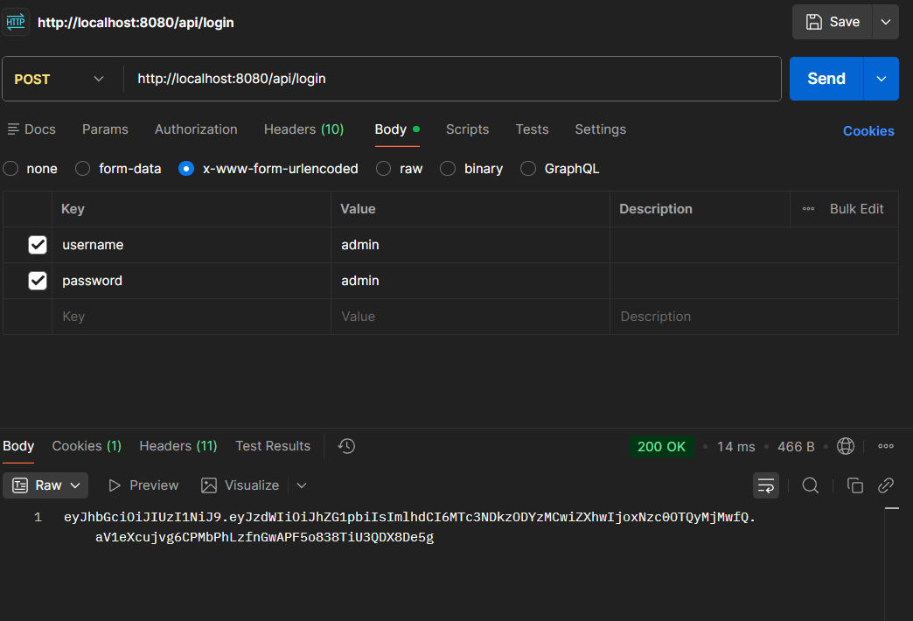
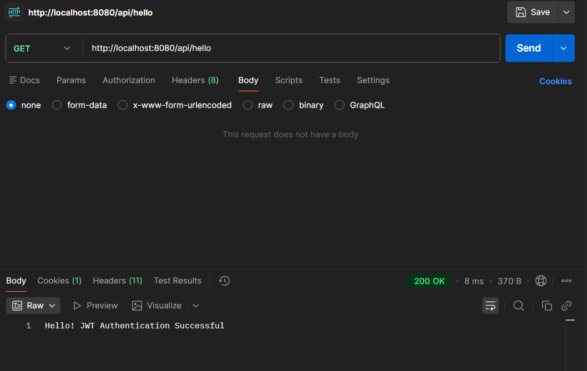

# JWT Demo Experiment

## Overview
This project is an experiment focused on JSON Web Tokens (JWT) security and encryption handling in a Spring Boot application. The primary goal is to demonstrate:
- authentication using username and password
- JWT generation and validation
- secure token-based access to protected endpoints

## Key Concepts
- **JWT Structure**: header, payload, signature
- **Signing Algorithms**: HMAC SHA-256 (HS256) is commonly used for symmetric signing
- **Token Workflow**:
  1. Client submits credentials to `/api/login`
  2. Server authenticates user and returns JWT
  3. Client sends JWT in `Authorization: Bearer <token>` header for protected routes (e.g., `/api/hello`)
  4. Server verifies payload and signature, then grants or denies access

## Security and Encryption Points
- Keep the secret key private and secure (do not commit to source control in real apps).
- Use HTTPS to prevent MITM token interception.
- Configure token expiration to limit replay attacks.
- On server side, validate:
  - token integrity (signature),
  - issuer/audience (if used),
  - expiration (`exp` claim)

## How to Run
1. Open the project in IDE (Maven/Spring Boot).
2. Run `JwtDemoApplication`.
3. Use HTTP client (Postman/cURL):
   - `POST http://localhost:8080/api/login` with form data `username=admin`, `password=admin`.
   - Receive JWT token.
   - `GET http://localhost:8080/api/hello` with header `Authorization: Bearer <token>`.

## Expected Behavior
- `GET /api/hello` without JWT or with invalid token returns `401 Unauthorized`.
- `GET /api/hello` with valid token returns message: `Hello! JWT Authentication Successful`.

### POST - login

### GET - hello
